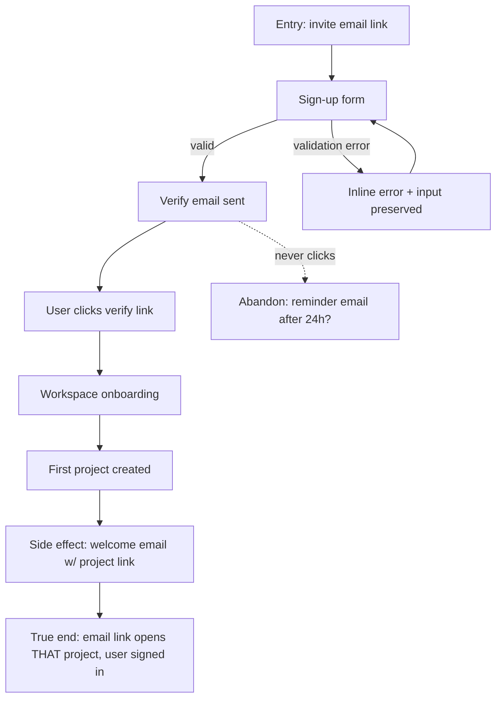

# Journeys and Flows

A journey is a sequence of user actions that delivers a specific value. Real-user QA targets journeys, not features: a feature can work in isolation while the journey it lives in is broken — and the breakage lives *between* the pages, exactly where page-level checks never look.

**The rule: flows before matrix.** No scenario exists until its journey is mapped as a flowchart. Scenarios derived by walking a flow test what a user lives through; scenarios invented from a feature list test what a developer built.

## Contents

- Why journeys instead of features
- Journey anatomy
- Mapping the flow (Mermaid)
- The true end state
- Identifying high-value journeys
- Journey file format
- Abandonment paths
- Cross-feature journeys
- Deriving scenarios from a flow
- Anti-patterns

## Why journeys instead of features

> "Think about the high-value interactions users will have with your application. Try to come up with user journeys that define the core value of your product." — Martin Fowler, *The Practical Test Pyramid*

A feature is a unit of engineering. A journey is a unit of value. Feature-level QA answers *"does this button work?"*; journey-level QA answers *"can someone actually buy something?"*.

## Journey anatomy

```
[entry] → [actions] → [goal] → [exit]
              ↓
        [branches & abandonment]
```

- **Entry** — how the user arrives: direct URL, search, email link, in-app nav, deep link, push.
- **Actions** — the interaction sequence; each action has an expected immediate observable.
- **Goal** — the value delivered. Not "submit clicked" — *"order received and confirmation visible"*.
- **Exit** — what happens after the goal: where the user lands, what they receive. The journey ends when the user leaves satisfied, not when the request returns 200.
- **Branches & abandonment** — every place the user can pause, choose differently, hit an error, or walk away and resume later.

## Mapping the flow (Mermaid)

Every journey file carries a `flowchart` that makes the anatomy visual and derivable. The flowchart MUST cover:

- the entry point(s),
- each user action as a node,
- **branch points**: validation error, empty state, permission denied, concurrent-edit conflict,
- **side effects** as explicit nodes: emails sent, jobs enqueued, notifications fired, records created,
- the **true end state** (below), and at least one abandonment path.



A side effect is not verified when it fires — it is verified when it lands correctly: *"an email sends"* is not a pass; the right recipient, the right content, and the link opening the right destination is.

## The true end state

The most common way QA lies is by stopping at the action. The flow's terminal node is where the user's value is confirmed:

- After checkout: the confirmation is visible, the receipt email cites the same order id, and the order appears in history.
- After a settings save: the setting is re-read from a fresh load, not from the optimistic UI.
- After an invite: the invitee's link works, lands in the right workspace, with the right role.

If the flowchart's last node is a button click, the flow is not finished being mapped.

## Identifying high-value journeys

For release cycles, pick 3-7 journeys by risk:

- **What generates revenue?** (checkout, upgrade, payment method change)
- **What handles sensitive data?** (auth, password reset, export, deletion)
- **What's used most frequently?** (the product's "verb" — search, send, post, save)
- **What's the first impression?** (landing → signup → first task)
- **What's the recovery path?** (after failed payment, session expiry, 5xx)

For branch/PR cycles, scope by the diff instead: every user-visible change maps to the journey(s) it touches — new flows get mapped, touched flows get updated.

## Journey file format

One file per journey at `<qa-docs-path>/journeys/J-<slug>.md` — the id is the content-addressed slug (2-5 kebab-case words naming the value, e.g. `J-first-purchase`), never a sequence number. The Mermaid flowchart first, then the YAML map:

```yaml
journey:
  id: J-<slug>
  name: <verb-noun, e.g. "Complete first purchase">
  value_statement: "<what the user gains when this succeeds>"
  personas: [<primary persona>, <secondary persona>]
  entry_points:
    - url: <URL or deep link or CLI verb>
      origin: <direct | email | search | in-app-nav | push | external-share>
  actions:
    - step: 1
      verb: <what the user does, in user language>
      expected_observable: <what they should see/hear within 3 seconds>
    - step: 2
  goal:
    observable: <the exact state that proves success>
    side_effects: [email-sent, record-created, notification-fired]
  true_end_state: <the post-goal confirmation, incl. side-effect landing>
  exit:
    natural: <where the user lands after success>
  abandonment:
    - at_step: <N>
      how: <the realistic way a user gives up here>
      resume: <what happens when they come back>
  crosses: [<teams/services/externals this journey spans>]
```

## Abandonment paths

A journey map without abort paths cannot find the bugs that matter. For "Complete first purchase":

- **Aborted-A:** checkout → surprise shipping cost → close tab (is the cart preserved?).
- **Aborted-B:** payment fails → retry with another card → succeed (resilience).
- **Aborted-C:** session expires mid-checkout → return tomorrow → resume (continuity).

Abort paths surface the highest-impact bugs: cart resets, session loss, ghost orders, emails claiming an order that doesn't exist.

## Cross-feature journeys

Journeys crossing team or service boundaries get regression priority — no single owner watches the whole contract. Example: "set notification preferences and receive a notification" crosses settings UI → preferences API → notification service → email delivery; the settings test passes while the journey is broken. Mark them in `crosses:` and prefer them when picking cycle journeys.

## Deriving scenarios from a flow

Walk the flowchart node by node and edge by edge:

1. The happy path end-to-end (entry → true end state) = one scenario.
2. Each branch point (validation error, empty, denied) = one scenario if a real persona plausibly hits it.
3. Each abandonment path with its resume = one scenario.
4. Each side effect's landing (email content/destination, notification target) = one scenario.
5. Cross-check the five taxonomy dimensions (routed at Step 4 of the SKILL) for what walking the boxes doesn't reveal — experiential and cross-cutting concerns don't appear as nodes.

Each derived scenario becomes one scenario file (schema routed at Step 4 of the SKILL). If a flow yields more than ~10 scenarios, the journey is probably two journeys — split it.

## Anti-patterns

- **Matrix before flows** — enumerating checks from the diff's file list produces page tests. Map the flow first; derive from it.
- **Goal = "click submit"** — rewrite until the goal is something the user wanted, not something the system received.
- **Feature-named journeys** — "Settings page test" is a feature test mislabeled. Rename after the value: "Update notification preferences and receive one".
- **No abandonment path** — mandatory, at least one per journey.
- **Side effects as afterthoughts** — if the email/notification isn't a node in the flow, it will not be verified at its landing.
- **Step-by-step click recordings** — a journey is user-language verbs, not a Selenium script.
